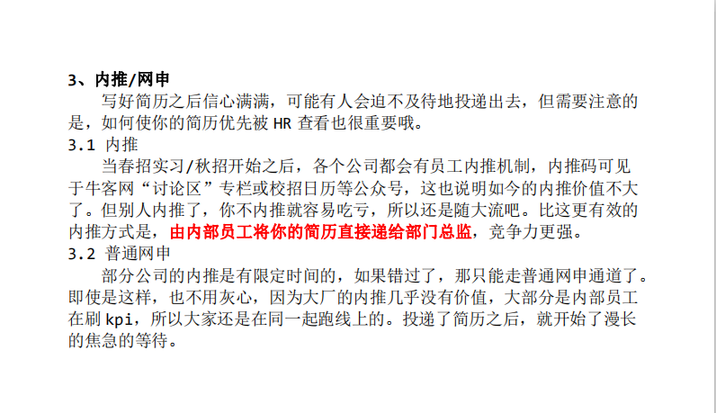

# debug君 - 深信服（已离职）, 目前在美团 21届, 计软, 计算机科学与技术（兼修数学）
> 选择比努力重要 

## 背景:

**竞赛:** 
&nbsp;&nbsp;&nbsp;&nbsp;- 2019国际大学生程序设计竞赛铜奖（哈尔滨站） 
&nbsp;&nbsp;&nbsp;&nbsp;- 2019中国大学生程序设计竞赛铜奖（沈阳/银川站）

**实习经历：** 
&nbsp;&nbsp;&nbsp;&nbsp;- 腾讯科技有限公司，实习时间 2020.5 - 2020.8 

**技术能力：** 
&nbsp;&nbsp;&nbsp;&nbsp;- c++/go 
&nbsp;&nbsp;&nbsp;&nbsp;- 算法与数据结构 
&nbsp;&nbsp;&nbsp;&nbsp;- 数据库等 

## Offer Show
最终去向 (公司+岗位): 深信服 后台开发 

|  申请项目   | 结果 |
|  ----  | ----  |
| 腾讯后端实习  | ❌ |
| 网易游戏  | ✅ |
| 深信服  | ✅ |
| 华为  | ✅ |
| 京东  | ✅ |

## 经历分享:
个人复习，以 小林coding为主，并结合它的资料，整理了自己的知识网络体系。

实习找工作时写过一篇面经：[link](https://www.nowcoder.com/discuss/353156335023890432?)

复习没有太多技巧，稳扎稳打。八股+刷题。

下面列举一些注意事项。

 - 如果是去腾讯实习的同学，注意它的转正率是比较低的（50%甚至更低），建议直接拿它的秋招offer，或者暑期实习期间不要all  in，找其他back up。 
 - 上岸有时挺吃运气，多投几家，总有上岸的。心态要稳住。 
 - 腾讯很擅长“鞭尸”，可能是纯粹刷kpi。 
 - 签三方前，不要有侥幸心理，公司可能只是把你做备胎，可能会鸽你offer。 
 - 做“海王”（社会就是这么个社会），多几个备份offer。择优上岸。 
 - 选择offer时，要多考察这家公司的风评，可以上脉脉看看。 
 - 拿了正式offer后，最好去那家公司实习下，看适不适合自己。 
 - 签劳动合同时，注意工资选项的说法。**如果上面写的是绩效奖金，而不是固定基础工资**，一定要留意。这种写法，公司有操作空间，可以哪天经营不善，给你做降薪操作。 

## 总结
在校招和社招方面踩过挺多坑，经历过挺多毒打。

校招（春招实习+秋招+春招补录）累计有70+场技术面试。

经历过两次社招，曾1年之内待过3家公司。

感兴趣戳文章（文章没有太多经验总结，主要记录了心路历程）：

**四月，遇见了更好的自己**：[link](https://mp.weixin.qq.com/s?__biz=MzkzOTM5MzQyMQ==&mid=2247484125&idx=1&sn=f0a1f3651ac1433520e20fce52d3a34f&chksm=c2f0ea3ff5876329705dd0a7f342a8a2334cbb5638877269d4db3e3664859c2a8824f8c54ce9&scene=21#wechat_redirect)

**2023小结**：[link](https://mp.weixin.qq.com/s?__biz=MzkzOTM5MzQyMQ==&mid=2247485559&idx=1&sn=1b2da68c67ac4c24b3471dcee753e722&chksm=c2f0e095f58769837ff04b840061c2831590366f2b4be93b92f200c270e13789c64979650604&token=619914128&lang=zh_CN#rd)

## 联系方式
&nbsp;&nbsp;&nbsp;&nbsp;- 公众号: 对方正在debug 
&nbsp;&nbsp;&nbsp;&nbsp;- 美团校招内推码：D9HV4FE 

## 附 16级 (20届) 师兄 clarklin 的上岸心得

